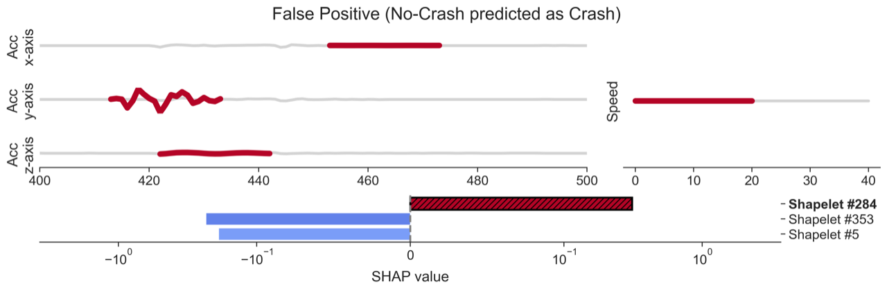
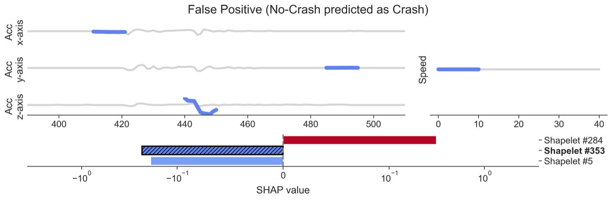
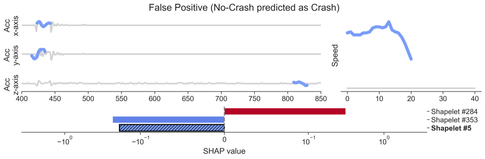
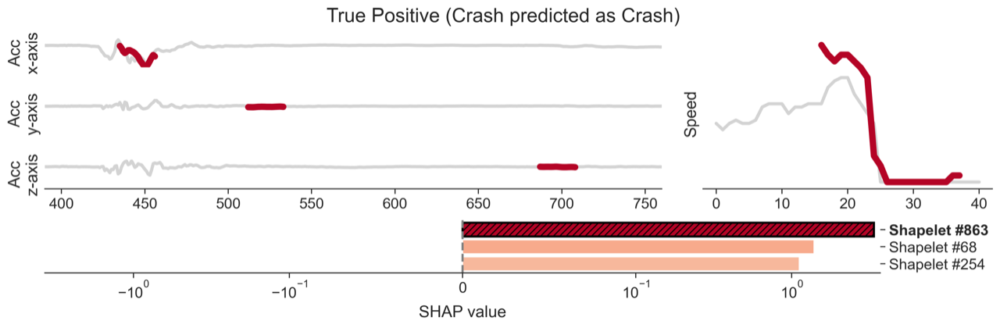
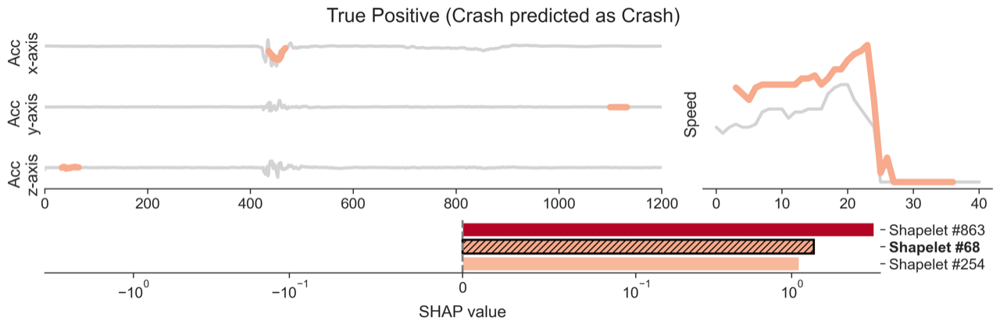
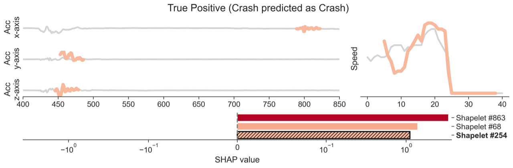

# Multivariate Asynchronous Random Shapelets (MARS)

MARS [1] is an interpretable shapelet-based time series transformer that uses the novel concept of multivariate asynchronous shapelets. It can handle highly irregular and imbalanced time series datasets, outperforming state-of-the-art classifiers and anomaly detection algorithms.

Shapelets are time series subsequences that are maximally representative of a class [2].

MARS' shapelets are:
- **Multivariate**: shapelets span all dimensions of the input time series. The distance between a shapelet and a time series is the sum of the minimum distances across each dimension.
- **Asynchronous**: (by default) each dimension of a shapelet can be extracted from a different timestamp, and is compared against all timestamps of the corresponding dimension in the target series.
- **Random**: shapelets are sampled randomly for computational efficiency.

## How it works

MARS follows the scikit-learn `fit` / `transform` interface. It is a **transformer**, not a classifier: it converts a dataset of multivariate time series into a matrix of shapelet distances, which can then be passed to any classifier of your choice.

```
Time series dataset  →  MARS.fit()  →  MARS.transform()  →  Distance matrix  →  Classifier
```

**Input format**: a dataset is a list of multivariate time series. Each time series is a list of dimensions (arrays), one per channel. Dimensions can have different lengths (irregular series are supported).

## How to install

```bash
pip install git+https://github.com/bianchimario/MARS
```

## Requirements

- numpy
- scikit-learn
- joblib

## Quick start

```python
from MARS import MARS
import lightgbm as lgb
from sklearn.metrics import classification_report

# 1. Fit MARS on the training set
mars = MARS(
    num_shapelets=100,
    min_len=10,
    max_len=50,
    seed=42,
    n_jobs=-1
)
mars.fit(X_train)

# 2. Transform train and test sets into distance matrices
X_train_transformed = mars.transform(X_train)
X_test_transformed  = mars.transform(X_test)

# 3. Train any classifier on the distance matrix
clf = lgb.LGBMClassifier()
clf.fit(X_train_transformed, y_train)

y_pred = clf.predict(X_test_transformed)
print(classification_report(y_test, y_pred))
```

## Parameters

| Parameter | Type | Default | Description |
|---|---|---|---|
| `num_shapelets` | int | — | Number of shapelets to extract |
| `min_len` | int | — | Minimum shapelet length |
| `max_len` | int | — | Maximum shapelet length |
| `async_limit` | int or None | None | Controls asynchrony across dimensions. `None` = fully asynchronous (each dimension extracted from an independent random timestamp); `0` or negative = synchronous (same timestamp for all dimensions); positive integer = max allowed timestamp difference between dimensions |
| `indexes` | bool | False | If `True`, `transform()` also returns, for each (time series, shapelet) pair, the timestamp index of the best match in the target series — useful for explainability |
| `shapelet_indexes` | bool | True | If `True`, `fit()` stores the index of the source time series from which each shapelet was extracted |
| `seed` | int or None | None | Random seed for reproducibility |
| `n_jobs` | int | -1 | Number of parallel jobs for `transform()` (passed to `joblib`) |

## Retrieving match indexes for explainability

When `indexes=True`, `transform()` returns a second object containing, for each time series and each shapelet, the position of the best match per dimension.

```python
mars = MARS(num_shapelets=100, min_len=10, max_len=50, indexes=True)
mars.fit(X_train)

X_train_transformed, train_idxs = mars.transform(X_train)
X_test_transformed,  test_idxs  = mars.transform(X_test)
```

`train_idxs[i][j]` is a list of per-dimension match positions for the j-th shapelet on the i-th time series.

## Explanation examples

The images below show examples of shapelet matches on car crash time series (true positives and false positives from [1]):








## References

[1] Bianchi, M., Spinnato, F., Guidotti, R., Maccagnola, D., Bencini Farina, A. (2025). Multivariate Asynchronous Shapelets for Imbalanced Car Crash Predictions. In: Pedreschi, D., Monreale, A., Guidotti, R., Pellungrini, R., Naretto, F. (eds) Discovery Science. DS 2024. Lecture Notes in Computer Science, vol 15243. Springer, Cham. https://doi.org/10.1007/978-3-031-78977-9_10

[2] Ye, Lexiang, and Eamonn Keogh. 'Time Series Shapelets: A Novel Technique That Allows Accurate, Interpretable and Fast Classification'. Data Mining and Knowledge Discovery 22, no. 1–2 (January 2011): 149–82. https://doi.org/10.1007/s10618-010-0179-5.
