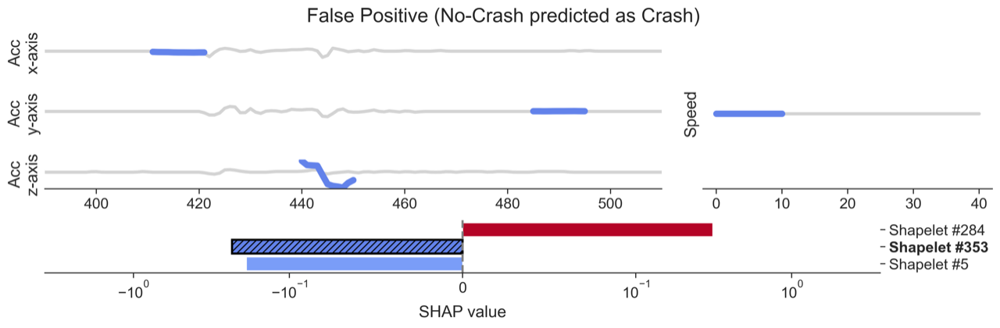

# Multivariate Asynchronous Random Shapelets (MARS)

MARS [1] is an interpretable shapelet-based classifier that uses the novel concept of multivariate asynchronous shapelets. It can handle highly irregular and unbalanced time series dataset, outperforming state-of-the-art classifiers and anomaly detection algorithms.

Shapelets are time series subsequences that are maximally representative of a class [2]. <br>

MARS' shapelets are:
+ Multivariate: shapelets have the same number of dimensions of the time series provided. The distance between a shapelet and a time series is calculated as the sum of the minimum distance for each dimension.
+ Asynchronous: (by default) the different dimension of the shapelets can be extracted from different timestamps and they are compared with each timestamp of the time series.
+ Random: shapelets are extracted randomly for the sake of computation time.

## How to install
```
pip install git+https://github.com/bianchimario/MARS
```

## Requirements
+ numpy
+ scipy
+ random
+ awkward

## Explanation examples




  


## References
[1] Bianchi, M., Spinnato, F., Guidotti, R., Maccagnola, D., Bencini Farina, A. (2025). Multivariate Asynchronous Shapelets for Imbalanced Car Crash Predictions. In: Pedreschi, D., Monreale, A., Guidotti, R., Pellungrini, R., Naretto, F. (eds) Discovery Science. DS 2024. Lecture Notes in Computer Science(), vol 15243. Springer, Cham. https://doi.org/10.1007/978-3-031-78977-9_10 <br>
[2] Ye, Lexiang, and Eamonn Keogh. ‘Time Series Shapelets: A Novel Technique That Allows Accurate, Interpretable and Fast Classification’. Data Mining and Knowledge Discovery 22, no. 1–2 (January 2011): 149–82. https://doi.org/10.1007/s10618-010-0179-5. <br>

